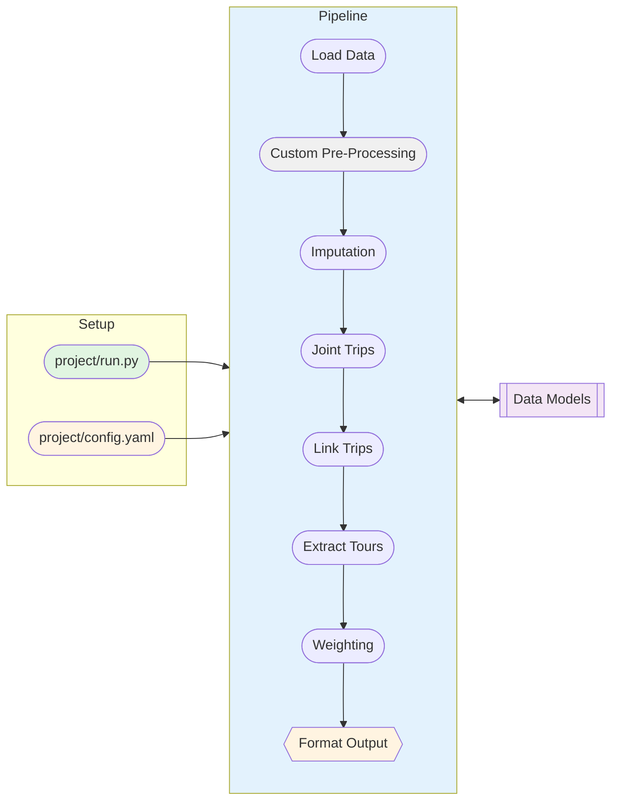

# Travel Diary Survey Tools
Tools for processing and validating travel diary survey data into standardized formats for transportation modeling.

## Objectives
* **Standardized**
  * Standardized data models for travel diary surveys
  * Standardized data processing algorithms
  * Comprehensive validation framework that checks both schema and content
* **Replicable**
  * Reproducible data processing pipelines
  * Transparent, modular, and well-documented algorithms
* **Extensible**
  * Modular processing steps, enabling new steps to be added easily
  * Customizable pipeline configurations for module logic and parameters
  * Adaptable output formats (e.g., ActivitySim, DaySim, CT-RAMP, General Analysis, etc.)

## Overview

* **Validate** input/output between each step to ensure data integrity
* **Format** at end only, retain consistent internal data structure throughout pipeline
* **Custom pre-processing** step for data cleaning, rather than muddling the source code with one-off fixes

## Architecture

The usage pattern for the pipeline is a bit different than the typical numbered scripts you might see elsewhere. *There is no monolithic integrated script*. Instead there is a standardized data processing pipeline that is configurable via YAML files and executed via a runner script.

There are three main components:
* **Setup**
  * This contains thepoint of entry defined in `project/run.py` and
  * Pipeline configuration defined in `project/config.yaml`
* **Pipeline Execution**
  * The central `Pipeline` class defined in `src/processing/pipeline.py`
  * A set of modular processing steps defined in `src/processing/steps/`
* **Data Models and Validation**
  * Canonical data models and validation logic defined in `src/data_canon/`
  * This can be used standalone, but also is integrated into the pipeline steps for automatic validation
  * The data models define the expected schema and content for each data table (households, persons, days, trips, tours, vehicles, etc.) Each field is tagged with a set of constraints, and the step it pertains.

### Diagram


## Data Standards and Documentation

- [Validation Framework](docs/VALIDATION_README.md) - Comprehensive data validation system
- [Column Requirements](docs/COLUMN_REQUIREMENTS.md) - Field requirements per pipeline step
- [Codebook](docs/CODEBOOK_README.md) - Enumeration definitions and labeled values

---

# Usage

## Quick Start

### Installing UV

1. Open PowerShell and run (or follow another method from https://docs.astral.sh/uv/getting-started/installation/):
```powershell
powershell -c "irm https://astral.sh/uv/install.ps1 | iex"
```
2. Verify the installation. You may need to restart your terminal:
```powershell
uv --version
```
3. Create a virtual environment.
```powershell
uv sync
```
4. Activate the virtual environment.
```powershell
source .venv/Scripts/activate
```
In VSCode you can select the interpreter manually with the GUI.

### Configuration

The pipeline is configured using YAML files that specify input data, steps, and parameters:

```yaml
# config.yaml

# Define directory shorthands
survey_dir: "M:/some/path/to/survey/data"
output_dir: "M:/some/path/to/output/data"
taz_shapefile: "X:/travel-model-one-master/utilities/geographies/bayarea_rtaz1454_rev1_WGS84.shp"

# Pipeline configuration
steps:
  - name: load_data
    validate: false # This will override @step(validate=True/False) in the function definition
    params:
      input_paths:
        households: "{{ survey_dir }}/hh.csv"
        persons: "{{ survey_dir }}/person.csv"  
        days: "{{ survey_dir }}/day.csv"
        unlinked_trips: "{{ survey_dir }}/trip.csv"

  - name: custom_cleaning
    validate: false

  # - name: imputation
  #   validate: true

  - name: link_trips
    validate: true
    params:
      change_mode_code: 11  # Purpose code for 'change_mode'
      transit_mode_codes: [12, 13, 14]
      max_dwell_time: 180  # in minutes
      dwell_buffer_distance: 100  # in meters

  - name: extract_tours
    validate: true

  - name: custom_add_taz_ids
    validate: true
    params:
      taz_shapefile: "{{ taz_shapefile }}"
  
  - name: weighting
    validate: true
  
  - name: final_check
    validate: true

  - name: format_output
    validate: true
    params:
      format: "daysim"
      outputs:
        households_daysim: "{{ survey_dir }}/hh_daysim.csv"
        persons_daysim: "{{ survey_dir }}/person_daysim.csv"
        days_daysim: "{{ survey_dir }}/day_daysim.csv"
        linked_trips_daysim: "{{ survey_dir }}/linked_trip_daysim.csv"
        tours_daysim: "{{ survey_dir }}/tour_daysim.csv"
  
  - name: format_output
    validate: false
    params:
      format: "standard"
      outputs:
        households: "{{ output_dir }}/households.csv"
        persons: "{{ output_dir }}/persons.csv"
        days: "{{ output_dir }}/days.csv"
        unlinked_trips: "{{ output_dir }}/unlinked_trips.csv"
        linked_trips: "{{ output_dir }}/linked_trips.csv"
        tours: "{{ output_dir }}/tours.csv"

```

### Pipeline Runner

You need a runner script to execute the pipeline, typically named `run.py`. This also allows for CLI execution for automation.

You can also inject custom pre-processing steps here. The goal is to keep the core pipeline code untouched for maintainability, but allow for custom logic to be added as needed.

```python
# project/run.py
from pathlib import Path
import polars as pl

from processing.decoration import step
from processing.pipeline import Pipeline

# Optional: project-specific custom step functions
# Could put this in a separate py file and import to keep this runner concise and consistent
@step()
def custom_cleaning(
    persons: pl.DataFrame,
    days: pl.DataFrame,
    unlinked_trips: pl.DataFrame
    ) -> dict[str, pl.DataFrame]:
    """Custom cleaning steps go here, not in the main pipeline."""

    # Do some stuff...
    unlinked_trips = unlinked_trips.rename({"arrive_second": "arrive_seconds"})
    days = days.with_columns(
        travel_dow = pl.col("dow_that_starts_from_0") + 1
    )

    return {"unlinked_trips": unlinked_trips, "days": days}

custom_steps = {
    "custom_cleaning": custom_cleaning,
}

# Path to the YAML config file you provided
CONFIG_PATH = Path(__file__).parent / "config_daysim.yaml"

# ---------------------------------------------------------------------
if __name__ == "__main__":
    logger.info("Starting FooBar Processing Pipeline")

    pipeline = Pipeline(config_path=CONFIG_PATH, custom_steps=custom_steps)
    result = pipeline.run()

    logger.info("Pipeline finished successfully.")

```

### `step` Decorator and Validation
To add a new processing step, simply define a function and decorate it with `@step()`, which lets the pipeline know it's a processing step and handles passing the params and validation automatically.

By default, the `@step()` decorator enables validation. You can override this in the config YAML per step with `validate: true/false`.

It will also parse the arguments based on the function signature, so make sure to name them according to the expected data models or config params. 

```python
from processing.decoration import step

@step(validate=True)
def new_processing_step(
    households: pl.DataFrame, # Must be a canonical data model named "households"
    persons: pl.DataFrame,    # Must be a canonical data model named "persons"
    other_arg1: int,          # Must be defined in the config.yaml under params for the step
    other_arg2: str           # Must be defined in the config.yaml under params for the step
) -> dict[str, pl.DataFrame]:
    """A new processing step example."""
    # Do some processing...
    persons = persons.filter(pl.col("age") >= 18)
    return {"persons": persons}
```


### Data Models and Validation

- Pydantic **data models** define expected schema and content for each data table
- Each field is tagged with constraints and the step it pertains to
- A library of **custom validators** are defined in `checks.py`, which handle more complex and contextual validation logic.
- Codebook of **enumerations** and labeled values are defined in `codebook/` for reuse across data models


For more details, see the [Validation Framework Documentation](docs/VALIDATION_README.md).


TODO @nick-fournier: ADD MORE DETAILS :)


## Project Structure

```
travel-diary-survey-tools/
├── src/
│   ├── data_canon/
│   │   ├── codebook/ <------------ # Define data categories here!
│   │   │   ├── days.py
│   │   │   ├── generic.py
│   │   │   ├── households.py
│   │   │   ├── persons.py
│   │   │   ├── tours.py
│   │   │   ├── trips.py
│   │   │   └── vehicles.py
│   │   └── core/                   # Core validation logic
│   │       ├── dataclass.py
│   │       ├── validators.py
│   │       └── step_field.py
│   └── processing/
│       ├── pipeline.py
│       ├── decoration.py
│       └── steps/ <--------------- # Define default processing steps here!
│           ├── load.py
│           ├── imputation.py       # Not yet implemented
│           ├── joint_trips.py      # Not yet implemented
│           ├── link.py
│           ├── extract_tours/
│           │   ├── extraction.py
│           │   ├── person_type.py
│           │   ├── priority_utils.py
│           │   └── tour_configs.py
│           ├── final_check.py      # Checks everything!
│           ├── weighting/
|           |   ├── base_weights.py
|           |   ├── prep_control_data.py
|           |   ├── prep_survey_data.py
|           |   ├── balancer.py
|           |   ├── base_weights.py
│           └── output_format/ <--- # Define bespoke output formatting here!
│               ├── daysim.py
│               ├── ctramp.py
│               └── activitysim.py
├── tests/                          # Test suite
├── scripts/                        # One-off helper scripts
├── examples/                       # Example configs and runners
└── docs/                           # Documentation
```

---

## Development

### Running Tests
Tests can be run using `pytest` via VSCode extension or command line:

```bash
# Run all tests
uv run pytest

# Run with coverage
uv run pytest --cov=src --cov-report=html

# Run specific test file
uv run pytest tests/test_validation.py -v
```

### Code Quality

The project uses `ruff` for linting and formatting:

```bash
# Run linter
ruff check src/some_module/

# Auto-fix issues
ruff check --fix src/some_module/

# Format code
ruff format src/some_module/
```

### Pre-commit Hooks

Install pre-commit hooks to ensure code quality before committing. It basically runs the linters and formatters automatically when you try to commit code. You can also run it manually with:

```bash
pre-commit run
```

## Contributing

1. Create a new branch for your feature
2. Make your changes with appropriate tests
3. Ensure all tests pass and code is formatted
4. Submit a pull request

## License

[Add license information here] :P
