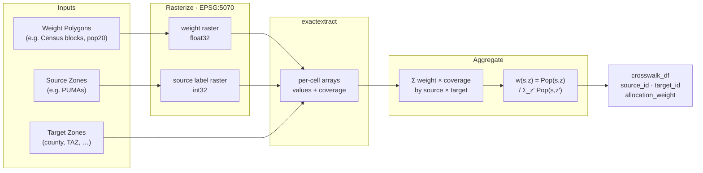
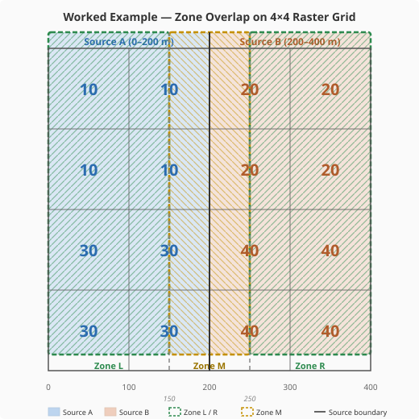

# Population-Weighted Geography Crosswalk

## Overview

`build_crosswalk` maps **source zones** to **target zones** via a
**weight polygon layer** (e.g. Census blocks with population counts).
Because source and target zone boundaries rarely align, the weight layer
is rasterized and [`exactextract`](https://github.com/isciences/exactextract)
performs a zonal cross-tabulation with sub-pixel coverage fractions.

The implementation lives in `src/utils/crosswalk.py`.

---

## Pipeline Diagram



---

## Mathematical Formulation

### 1. Rasterization

Two arrays are burned onto a common grid (CRS: EPSG:5070, NAD83 CONUS
Albers) at a configurable cell size (default 250 m):

| Array | Dtype | Cell value |
|-------|-------|------------|
| **Weight** (`pop`) | float32 | Block population distributed evenly across the cells each block covers: $\text{cell\_pop} = \frac{\text{block\_pop}}{n_\text{cells}}$ |
| **Source label** | int32 | Integer ID of the source zone covering that cell (0 = no data) |

### 2. Zonal Cross-Tabulation (exactextract)

Both rasters are written to temporary GeoTIFFs and passed to
[`exactextract`](https://github.com/isciences/exactextract) together
with the target-zone polygon layer:

```python
exact_extract(
    [weight_path, source_path],  # two rasters
    target_gdf,                  # target zone polygons
    ["values", "coverage"],      # per-cell arrays
    include_cols=["target_id"],
)
```

exactextract returns a list of GeoJSON-style feature dicts (no pandas).
For each target zone polygon $z$, three per-cell arrays are returned:

- $v_i^\text{weight}$ — weight value of cell $i$
- $v_i^\text{source}$ — integer source-zone label of cell $i$
- $c_i$ — **coverage fraction** of cell $i$ by polygon $z$
  (1.0 for fully interior cells, $0 < c_i < 1$ for boundary cells)

Coverage fractions are the key advantage over simple binary masking:
cells that straddle a polygon boundary contribute proportionally rather
than all-or-nothing.

### 3. Population by Source × Target Zone

Within each target zone $z$, cells are grouped by source label $s$ and
the coverage-weighted population is summed:

$$
\text{Pop}(s, z) = \sum_{\substack{i \in z \\ v_i^\text{source} = s}} v_i^\text{weight} \cdot c_i
$$

### 4. Allocation Weights

Each source zone's population is normalised across target zones:

$$
w(s, z) = \frac{\text{Pop}(s, z)}{\displaystyle\sum_{z'} \text{Pop}(s, z')}
$$

By construction, $\sum_z w(s, z) = 1$ for every source zone $s$.

---

## Worked Example

Consider a 400 × 400 m region with 100 m cells (4 × 4 grid):

- **Source A** covers the left half (x = 0–200 m)
- **Source B** covers the right half (x = 200–400 m)
- Three target zones whose boundaries do *not* align with cell edges:
  - **Zone L**: x = 0–150 m
  - **Zone M**: x = 150–250 m (straddles the source boundary)
  - **Zone R**: x = 250–400 m

### Zone overlap

The diagram below shows the 4 × 4 raster grid with source zones
(blue/orange fills) and target zones (dashed outlines) overlaid.
Population values are printed in each cell.  The target-zone edges at
x = 150 and x = 250 fall at cell midpoints, creating fractional coverage.



- **Zone L** (green dashes) covers col 0 fully and the left half of col 1 (coverage = 0.5).
- **Zone M** (gold dashes) covers the right half of col 1 (source A) and the left
  half of col 2 (source B) — each at coverage = 0.5.
- **Zone R** (green dashes) covers the right half of col 2 and all of col 3.

### Population grid (4 × 4, 100 m cells)

Each cell carries a population value and belongs to source A or B:

| | col 0 (A) | col 1 (A) | col 2 (B) | col 3 (B) |
|-------|-----------|-----------|-----------|-----------|
| row 0 | 10 | 10 | 20 | 20 |
| row 1 | 10 | 10 | 20 | 20 |
| row 2 | 30 | 30 | 40 | 40 |
| row 3 | 30 | 30 | 40 | 40 |

Columns 1 and 2 are the cells split by target-zone boundaries.
exactextract assigns **coverage = 0.5** to each half of those cells.

### Cross-tabulation math

**Zone L** (x = 0–150) covers col 0 fully and col 1 at 50% coverage:

$$
\text{Pop}(A, L) = \underbrace{(10+10+30+30)}_{col\,0} \times 1.0
                  + \underbrace{(10+10+30+30)}_{col\,1} \times 0.5
                  = 80 + 40 = 120
$$

**Zone M** (x = 150–250) covers col 1 at 50% (source A) and col 2 at
50% (source B):

$$
\text{Pop}(A, M) = (10+10+30+30) \times 0.5 = 40
$$
$$
\text{Pop}(B, M) = (20+20+40+40) \times 0.5 = 60
$$

**Zone R** (x = 250–400) covers col 2 at 50% and col 3 fully:

$$
\text{Pop}(B, R) = (20+20+40+40) \times 0.5
                  + (20+20+40+40) \times 1.0
                  = 60 + 120 = 180
$$

**Total**: 120 + 40 + 60 + 180 = 400 = sum of all cell values ✓

**Allocation weights**:

| Source | Zone | Pop | Weight |
|--------|------|-----|--------|
| A | L | 120 | 120/160 = **0.75** |
| A | M |  40 |  40/160 = **0.25** |
| B | M |  60 |  60/240 = **0.25** |
| B | R | 180 | 180/240 = **0.75** |

This example is reproduced exactly in `TestCrossTabMath` in
`tests/test_crosswalk.py`.

---

## Python API

```python
from utils.crosswalk import build_crosswalk

xw = build_crosswalk(
    source_gdf=pumas, target_gdf=counties, weight_gdf=blocks,
    source_id_col="PUMACE20", target_id_col="COUNTYFP",
    weight_col="pop20", resolution=250,
)
# Returns: pl.DataFrame[source_id, target_id, population, allocation_weight]
```

### Parameters

| Parameter | Type | Default | Description |
|-----------|------|---------|-------------|
| `source_gdf` | GeoDataFrame | — | Source zone polygons (e.g. PUMAs) |
| `target_gdf` | GeoDataFrame | — | Target zone polygons (e.g. counties, TAZs) |
| `weight_gdf` | GeoDataFrame | — | Weight polygons with a numeric column |
| `source_id_col` | str | `"source_id"` | ID column in *source_gdf* |
| `target_id_col` | str | `"target_id"` | ID column in *target_gdf* |
| `weight_col` | str | `"pop20"` | Numeric weight column in *weight_gdf* |
| `resolution` | int | `250` | Raster cell size in metres (EPSG:5070) |

### Returns

`pl.DataFrame` with columns:

| Column | Description |
|--------|-------------|
| `source_id` | Source zone identifier |
| `target_id` | Target zone identifier |
| `population` | Coverage-weighted population in this source × target pair |
| `allocation_weight` | Normalised weight (sums to 1.0 per `source_id`) |

---

## Design Decisions

1. **Why rasterize?**  Vector polygon overlay (intersections) is
   computationally expensive for large source × target combinations and
   produces slivers.  Rasterization converts the problem to fast array
   operations at a tuneable resolution.

2. **Why exactextract?**  Unlike binary `geometry_mask`, exactextract
   computes the *fraction* of each cell covered by each polygon.  This
   eliminates the counting bias at polygon boundaries where cells are
   partially inside the zone.

3. **Why temporary GeoTIFFs?**  exactextract v0.3 reads rasters via
   GDAL, which requires files on disk (or GDAL virtual filesystems).
   The temp files are deleted immediately after extraction.

4. **Why EPSG:5070?**  NAD83 CONUS Albers is an equal-area projection
   suitable for the contiguous US, ensuring cell areas are uniform
   across the study region.

---

## Dependencies

| Package | Role |
|---------|------|
| `rasterio` | Rasterize blocks/sources; write temporary GeoTIFFs |
| `exactextract` (≥ 0.3) | Zonal extraction with sub-pixel coverage fractions |
| `geopandas` | Read shapefiles, spatial operations |
| `numpy` | Array math for coverage-weighted sums |
| `polars` | Crosswalk DataFrame, weight algebra |
