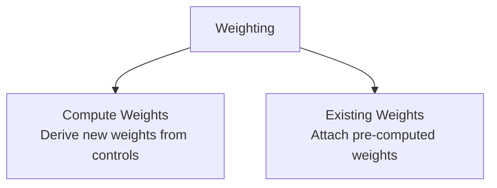

# Weighting

::: processing.weighting
    options:
      show_root_heading: true
      show_docstring_description: true
      members: false

## Overview

Weighting has two mutually exclusive options:

- **`compute_weights`** computes new weights from PUMS controls and survey seed data.
- **`add_existing_weights`** attaches weights that were already computed elsewhere.

Only the `compute_weights` option needs the full weighting pipeline machinery such as PUMS fetching, crosswalk construction, incidence preparation, control aggregation, balancing, diagnostics, and control validation. The `add_existing_weights` option is much lighter: it joins external weight files onto canonical tables and can optionally derive missing downstream weights through the survey hierarchy.

## Choose an Option

| Option | Use when | Key inputs | Main output |
|---|---|---|---|
| **Compute Weights** | You need to create expansion weights from controls | PUMS, geography, control definitions, survey tables | New household weights propagated to all tables |
| **Existing Weights** | You already have weight files from another system or prior run | Weight CSVs keyed to canonical IDs | Existing weights attached and optionally propagated |

## Options

The `compute_weights` option is the full control-based weighting pipeline. The `add_existing_weights` option bypasses that machinery and simply joins external weight files to the canonical tables, with optional downstream propagation.

For implementation details, see the dedicated pages for [compute_weights](compute_weights.md) and [existing_weights](existing_weights.md).
