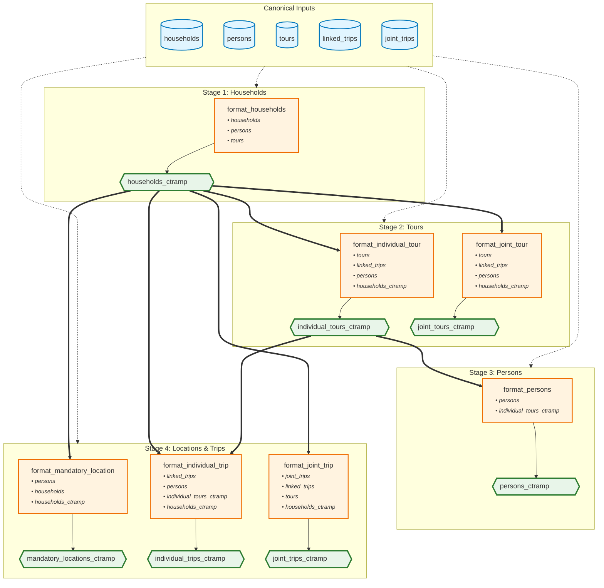

# CT-RAMP Formatting

This module transforms canonical survey data into CT-RAMP (Coordinated Travel - Regional Activity Modeling Platform) format for use with activity-based travel demand models.

## Overview

The main entry point is `format_ctramp()`, which orchestrates the transformation of households, persons, tours, and trips from canonical format into seven CT-RAMP tables. The module intelligently handles missing data and provides configurable income thresholds and filtering options.

## Components

### Households (`format_households.py`)
Produces **`households_ctramp`** table.

**Required Inputs:**
- `households_canonical` - hh_id, home_taz, income_detailed, income_followup, num_vehicles
- `persons_canonical` - hh_id, employment (for computing size/workers)
- `tours_canonical` - hh_id, joint_tour_id, tour_purpose (for joint tour frequency)

**Key Transformations:**
- **Income Conversion**: Converts categorical income values to midpoint dollars in configurable base year (e.g., $2000)
- **Income Bracketing**: Classifies households into low/med/high/very high income brackets using user-defined thresholds
- **Spatial Fields**: Maps home TAZ (optionally filters households without valid TAZ)
- **Joint Tour Frequency**: Derives `jtf_choice` field from joint tour counts by purpose category
- **Excludes**: Random number fields (`ao_rn`, `fp_rn`, `cdap_rn`, etc.) and `auto_suff` (model simulation fields)

### Persons (`format_persons.py`)
Produces **`persons_ctramp`** table.

**Required Inputs:**
- `persons_canonical` - person_id, hh_id, person_num, age, gender, employment, student, school_type, commute subsidies
- `tours_ctramp` - person_id, tour_purpose (already CT-RAMP formatted)
- `config` - CTRAMPConfig with thresholds

**Key Transformations:**
- **Person Type Classification**: Derives CT-RAMP person type from age category, employment status, and student status
- **Gender Mapping**: Converts to binary m/f format (configurable default for non-binary/missing)
- **Free Parking**: Determines eligibility based on commute subsidies
- **Tour Frequency Fields**: Derives `imf_choice` (mandatory tour frequency), `inmf_choice` (non-mandatory tour frequency), and `activity_pattern` from tour data when available
- **Work-from-Home**: Sets `wfh_choice` based on work tours vs work days
- **Value of Time**: Calculates based on employment type and household income bracket
- **Placeholders**: Uses sensible defaults when tour data is unavailable

### Mandatory Locations (`format_mandatory_location.py`)
Produces **`mandatory_locations_ctramp`** table.

**Required Inputs:**
- `persons_canonical` - person_id, hh_id, person_num, age, employment, student, work_taz, school_taz
- `households_canonical` - hh_id, home_taz
- `households_ctramp` - hh_id, income
- `config` - CTRAMPConfig

**Key Transformations:**
- Generates work and school location records for persons with usual work/school locations
- Links person characteristics with destination TAZ

### Individual Tours (`format_tours.py`)
Produces **`individual_tours_ctramp`** table.

**Required Inputs:**
- `tours_canonical` - tour_id, hh_id, person_id, person_num, tour_category, tour_purpose, o_taz, d_taz, times, tour_mode, joint_tour_id, parent_tour_id
- `linked_trips_canonical` - tour_id, tour_direction (for stop counts)
- `persons_canonical` - person_id, person_num, person_type, school_type
- `households_ctramp` - hh_id, income
- `config` - CTRAMPConfig

**Key Transformations:**
- **Filtering**: Excludes joint tours (processes only tours with `joint_tour_id IS NULL`)
- **Purpose Mapping**: Converts canonical purpose categories to CT-RAMP tour purposes
- **Mode Translation**: Maps canonical mode types to CT-RAMP mode codes
- **Time-of-Day**: Extracts start/end hours from departure/arrival times
- **Stop Counts**: Computes outbound and inbound stop counts from linked trips
- **Subtour Frequency**: Calculates `atWork_freq` by counting subtours for each parent work tour
- **Excludes**: Model simulation fields (random numbers, wait times, logsums)

### Joint Tours (`format_tours.py`)
Produces **`joint_tours_ctramp`** table.

**Required Inputs:**
- `tours_canonical` - tour_id, hh_id, joint_tour_id, tour_category, tour_purpose, times, tour_mode, o_taz, d_taz
- `linked_trips_canonical` - tour_id, tour_direction (for stop counts)
- `persons_canonical` - person_id, person_num, age (for composition)
- `households_ctramp` - hh_id, income
- `config` - CTRAMPConfig with age_adult threshold

**Key Transformations:**
- Identifies tours shared by multiple household members using `joint_tour_id`
- **Composition**: Classifies as adults-only, children-only, or mixed based on configurable age threshold
- **Participant List**: Maintains ordered list of `person_num` for all tour participants
- **Same Fields**: Purpose, mode, time-of-day, stops, destinations (like individual tours)

### Individual Trips (`format_trips.py`)
Produces **`individual_trips_ctramp`** table.

**Required Inputs:**
- `linked_trips_canonical` - tour_id, o_purpose_category, d_purpose_category, mode_type, o_taz, d_taz, tour_direction, times, person_id, hh_id
- `tours_ctramp` - tour_id, tour_purpose, tour_mode, tour_category (already CT-RAMP formatted)
- `persons_canonical` - person_id, person_num, school_type
- `households_ctramp` - hh_id, income
- `config` - CTRAMPConfig

**Key Transformations:**
- Links trips to individual tours via `tour_id`
- Includes stop purpose, mode, location, and sequence within tour
- Distinguishes outbound, inbound, and subtour trips

### Joint Trips (`format_trips.py`)
Produces **`joint_trips_ctramp`** table.

**Required Inputs:**
- `joint_trips_canonical` - joint_trip_id, hh_id, num_joint_travelers (aggregated mean coordinates)
- `linked_trips_canonical` - joint_trip_id, tour_id, o_purpose_category, d_purpose_category, mode_type, times, o_taz, d_taz
- `tours_canonical` - tour_id, joint_tour_id, tour_purpose, tour_category, tour_mode
- `households_ctramp` - hh_id, income
- `config` - CTRAMPConfig

**Key Transformations:**
- Links trips to joint tours using aggregated joint trip data
- Maintains participant information for each trip leg

## Supporting Modules

- **`ctramp_config.py`**: Pydantic configuration model with validation for income thresholds, age parameters, and defaults
- **`mappings.py`**: Lookup tables for person type, gender, employment, student status, mode, and purpose translations

## Data Flow

The following diagram shows how canonical input tables are transformed into CT-RAMP output tables:

```
CANONICAL INPUTS                FORMATTERS                    CT-RAMP OUTPUTS
================                ==========                    ===============

households_canonical ────┬──► format_households() ────────► households_ctramp
persons_canonical ───────┤         │
tours_canonical ─────────┤         └──────┐
                         │                │
                         │                ▼
                         ├──► format_individual_tour() ──► individual_tours_ctramp
                         │        (requires:                      │
                         │         households_ctramp)             │
                         │                │                       │
linked_trips_canonical ──┤                │                       │
                         │                ▼                       │
                         └──► format_persons() ─────────────────► persons_ctramp
                                  (requires:
                                   individual_tours_ctramp)
                                       │
                    ┌──────────────────┴──────────────────┐
                    ▼                                      ▼
         format_mandatory_location()          format_individual_trip()
          (requires:                           (requires:
           households_canonical +               individual_tours_ctramp +
           households_ctramp)                   persons_canonical +
                    │                            households_ctramp)
                    ▼                                      │
         mandatory_locations_ctramp                        ▼
                                              individual_trips_ctramp


joint_trips_canonical ───┬──► format_joint_tour() ──────► joint_tours_ctramp
tours_canonical ─────────┤        (requires:
linked_trips_canonical ──┤         households_ctramp +
persons_canonical ───────┤         persons_canonical)
households_ctramp ───────┤                │
                         │                ▼
                         └──► format_joint_trip() ───────► joint_trips_ctramp
                                  (requires:
                                   tours_canonical +
                                   households_ctramp)
```

**Key Dependencies:**
1. `households_ctramp` must be created first (needed by all downstream formatters)
2. `individual_tours_ctramp` must be created before `persons_ctramp` (provides tour statistics)
3. `persons_ctramp` and trips use already-formatted tour/household data
4. Joint tables can be processed independently from individual tables

### Mermaid Diagram



**Legend:**
- 🔵 **Blue cylinders**: Canonical input tables
- 🟠 **Orange boxes**: Formatter functions
- 🟢 **Green hexagons**: CT-RAMP output tables (all formatted)
- **Dashed arrows (⋯→)**: Canonical inputs available to formatters (see component details above for specifics)
- **Thick solid arrows (⟹)**: Formatted table dependencies (execution order)

**Note:** Canonical input details for each formatter are listed in the [Components](#components) section above.

## Usage

The `format_ctramp()` function requires canonical data tables and configuration parameters:

```python
from processing.formatting.ctramp import format_ctramp

result = format_ctramp(
    persons=canonical_persons,
    households=canonical_households,
    linked_trips=canonical_linked_trips,
    tours=canonical_tours,
    joint_trips=canonical_joint_trips,
    income_low_threshold=60000,          # $60k divides low from medium
    income_med_threshold=150000,         # $150k divides medium from high
    income_high_threshold=250000,        # $250k divides high from very high
    income_base_year_dollars=2000,       # Convert income to $2000
    drop_missing_taz=True                # Remove households without TAZ
)

# Access formatted tables
households_ctramp = result["households_ctramp"]
persons_ctramp = result["persons_ctramp"]
mandatory_locations_ctramp = result["mandatory_locations_ctramp"]
individual_tours_ctramp = result["individual_tours_ctramp"]
joint_tours_ctramp = result["joint_tours_ctramp"]
individual_trips_ctramp = result["individual_trips_ctramp"]
joint_trips_ctramp = result["joint_trips_ctramp"]
```

### Configuration Parameters

All thresholds and defaults are managed via `CTRAMPConfig`:

- **Income Thresholds** (`income_low_threshold`, `income_med_threshold`, `income_high_threshold`): Dollar values defining income bracket boundaries (validated to ensure proper ordering)
- **Income Base Year** (`income_base_year_dollars`): Target year for income conversion (e.g., 2000, 2010)
- **TAZ Filtering** (`drop_missing_taz`): Whether to exclude households without valid TAZ assignments
- **Age Threshold** (`age_adult`): Age category value separating adults from children in joint tour composition (default: 4 = 18+)
- **Gender Default** (`gender_default_for_missing`): Binary gender value ('m' or 'f') for non-binary/missing values (default: 'f')

See [ctramp_config.py](ctramp_config.py) for complete configuration options with validation rules.

## Implementation Notes

### Excluded Fields

**Random Number Fields**: Excluded because they are simulation-specific and not derivable from survey data:
- Household: `ao_rn`, `fp_rn`, `cdap_rn`
- Tour: `imtf_rn`, `imtod_rn`, `immc_rn`, `jtf_rn`, `jtl_rn`, `jtod_rn`, `jmc_rn`, `inmtf_rn`, `inmtl_rn`, `inmtod_rn`, `inmmc_rn`, `awf_rn`, `awl_rn`, `awtod_rn`, `awmc_rn`, `stf_rn`, `stl_rn`

**Model Output Fields**: Also excluded:
- `auto_suff`: Auto sufficiency (miscoded per CT-RAMP documentation)
- `walk_subzone`: Walk-to-transit accessibility (requires spatial modeling)
- Wait times and logsums (model simulation outputs)

### Placeholder Values

When tour data is unavailable or incomplete, person-level tour frequency fields use these defaults:
- `activity_pattern`: 'H' (home all day)
- `imf_choice`: 0 (no mandatory tours)
- `inmf_choice`: 1 (minimum valid code)
- `wfh_choice`: 0 (no work from home)
- `jtf_choice`: Derived from joint tour data if available; otherwise `NONE_NONE` (-4)

### Data Flow

1. **TAZ Filtering** (optional): Households without valid `home_taz` are removed, cascading to persons, tours, and trips
2. **Households**: Formatted first to establish income brackets needed downstream
3. **Tours**: Formatted before persons to provide tour frequency statistics
4. **Persons**: Combines tour-derived fields (activity patterns, frequencies) with demographic characteristics
5. **Mandatory Locations**: Uses both canonical (TAZ) and formatted (income) household data
6. **Trips**: Formatted last, linking to already-formatted tours

### Empty Data Handling

The module gracefully handles missing data:
- Empty tour DataFrames result in placeholder person fields
- Missing joint tour IDs default to individual tour treatment
- Missing or null values use sensible defaults per field type
## Reference

### Data Models

Complete field definitions and schemas are available in [src/data_canon/models/ctramp.py](../../data_canon/models/ctramp.py):
- `HouseholdCTRAMPModel` - 7 core fields including income, TAZ, size
- `PersonCTRAMPModel` - 20+ fields including person type, activity patterns, tour frequencies
- `MandatoryLocationCTRAMPModel` - Work/school location records
- `IndividualTourCTRAMPModel` - Tour-level attributes (purpose, mode, time, stops)
- `JointTourCTRAMPModel` - Joint tour with composition and participants
- `IndividualTripCTRAMPModel` - Trip-level attributes for individual tours
- `JointTripCTRAMPModel` - Trip-level attributes for joint tours

### Codebooks

Enumeration definitions and value mappings in [src/data_canon/codebook/ctramp.py](../../data_canon/codebook/ctramp.py):
- `CTRAMPPersonType` - Full-time worker, part-time worker, student types, etc.
- `CTRAMPModeType` - Drive alone, shared ride, transit, walk, bike, etc.
- `CTRAMPTourCategory` - Mandatory, non-mandatory, at-work subtours
- `IMFChoice`, `INMFChoice`, `JTFChoice` - Tour frequency alternatives
- `TourComposition` - Adults-only, children-only, mixed

### Related Modules

- [DaySim formatting](../daysim/README.md) - Alternative ABM format
- [Canonical data models](../../data_canon/models/) - Input format specifications
- [Tour extraction](../../tours/) - Derives tours from linked trips
