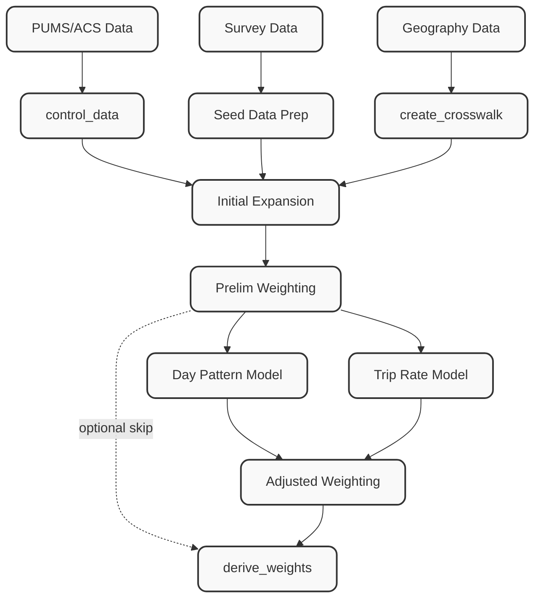

[← Back to Main README](../../../README.md)

# Weighting Pipeline — Development Plan

This document describes the planned architecture for the full weighting pipeline. The existing `add_existing_weights` step handles the case where external weights are already available. This plan covers computing weights from scratch using PUMS/ACS data as population controls.

---

## Overview

The weighting pipeline produces **expansion weights** that scale the survey sample to represent the full population. It is exposed as a **single `weighting` pipeline step** — it plugs into the pipeline like any other step via `@step()` and a YAML config block, but internally it is a self-contained module that can also be run standalone outside the pipeline.

Internally the step orchestrates five sub-components:

1. **Geography Crosswalk** — Translate between PUMS PUMAs and the project's custom weighting geography using Census block groups as the intermediary.
2. **Control Data Preparation** — Load PUMS 1-year microdata, apply the crosswalk, and aggregate into marginal control totals using YAML-configured variable bins and cross-tab targets.
3. **Survey Prep** — Recode canonical survey variables into the same bin/group categories as the controls.
4. **Maximum Entropy Weighting** — Expand households into seed records (with optional DOW expansion), then fit weights using PopulationSim's balancer.
5. **Derive Weights** — Propagate final weights to all canonical tables (persons, days, trips, tours).

Day-of-week weighting is supported natively: households are expanded into household-day records so that each travel day can be weighted by user-configurable day groups (e.g., weekday/weekend). DOW groups are fully defined in the YAML config.

Behavioral adjustment models (day pattern, trip rate) are **not in scope for the current phase**.



---

## Resolved Design Decisions

| # | Decision | Resolution |
|---|----------|------------|
| 1 | **PopulationSim dependency** | Use PopulationSim's core numba balancer (`populationsim.balancing.balancers_numba.np_balancer_numba`) directly, bypassing PopulationSim's own pipeline/config infrastructure. If the numba function's interface proves awkward, step up to the `ListBalancer` wrapper class (`populationsim.balancing.single_balancer.ListBalancer`). If even that is too entangled with PopulationSim internals, create a streamlined port of the core algorithm (the numba function is ~120 lines of self-contained iterative Newton-Raphson). |
| 2 | **Control geography level** | The control geography is **always user-specified** via the YAML config. If the user's control geography already aligns with PUMAs (e.g., the user passes PUMA polygons), the crosswalk step is effectively a pass-through (1:1 mapping). If it's a custom geography (county, super-district, TAZ cluster, etc.), the BG-based crosswalk converts PUMA controls into that geography. The config requires an explicit `control_geo` parameter — there is no default geography level. |

---

## Module Structure

The weighting module is exposed to the pipeline as a **single `@step()` entry point** (`weighting.py`). All sub-components live in a `core/` sub-package and can also be imported directly for standalone use.

```
src/processing/weighting/
├── __init__.py
├── existing_weights.py        # ✅ Implemented — attach pre-computed weights
├── weighting.py               # ✅ Implemented — single @step() entry point
├── DEVELOPMENT_PLAN.md
│
├── controls/                  # ✅ Implemented — split from old core/controls.py + control_enums.py
│   ├── __init__.py
│   ├── enums.py               #   IntEnum categories for collapsing controls
│   ├── base.py                #   ControlLevel, ControlTarget base class, shared helpers
│   ├── household.py           #   HHSize, HHIncome, HHWorkers, HHVehicles, HHChildren
│   ├── person.py              #   Gender, Employment, CommuteMode, Student, Education, Race, Ethnicity, Age
│   └── registry.py            #   CONTROLS dict, resolve_targets(), pums_variables()
│
├── data_prep/                 # ✅ Implemented — PUMS I/O, recoding, geography + crosswalk
│   ├── __init__.py
│   ├── census_geo.py          #   TIGER shapefile download via pygris (PUMAs, blocks)
│   ├── crosswalk.py           #   rasterized PUMA→target-zone crosswalk (exactextract)
│   ├── pums_data.py           #   PUMS download/load via cenpy
│   ├── control_data.py        #   PUMS control totals (crosswalk-aware)
│   └── seed_data.py           #   recode survey variables to match controls
│
├── balancing/                 # ✅ Implemented — the weighting engine
│   ├── __init__.py
│   ├── balancer.py            #   max entropy balancing (PopulationSim numba core)
│   ├── base_weights.py        #   initial expansion weights (sample-plan or PUMS-target)
│   ├── weight_propagation.py  #   propagate weights to all canonical tables
│   ├── dow.py                 # 🔲 Planned — DOW household-day expansion
│   └── importance.py          # 🔲 Planned — control importance weights from PUMS MOE/variance
│
└── validation/                # ✅ Implemented — post-balancing checks
    ├── __init__.py
    ├── checksums.py           #   recode null checks + incidence-sum overcount detection
    ├── weight_checks.py       #   post-balancing sanity checks
    └── diagnostics.py         # 🔲 Planned — HTML diagnostic report (Plotly)
```

### TODO: Control importance calculator (`importance.py`)

The balancer currently passes `controls_importance = np.ones(...)` — all controls are weighted equally. This is suboptimal: controls with high sampling variance (wide MOE) should be given less importance so the balancer doesn't chase noise.

**Proposed formula:**

$$
\text{importance}_i = \frac{1}{\sqrt{\text{Var}(\hat{t}_i)}}
$$

where $\hat{t}_i$ is the PUMS estimate for control cell $i$ and $\text{Var}(\hat{t}_i)$ is derived from the PUMS margin of error (MOE):

$$
\text{SE} = \frac{\text{MOE}}{1.645} \quad\Rightarrow\quad \text{Var} = \text{SE}^2
$$

The MOE can be:
1. **Directly provided** — PUMS published tables include MOE columns alongside estimates.
2. **Calculated from replicate weights** — using the `samplics` library's `ReplicateEstimator` with the 80 PUMS replicate weight columns (`WGTP1`–`WGTP80` for HH, `PWGTP1`–`PWGTP80` for persons). This is more accurate for custom geographies where published MOEs don't exist.

The importance vector is then normalized so the median equals 1.0 (preserving the current default behavior for well-estimated controls while down-weighting noisy ones).

---

## Component Specifications

Each sub-component is documented here as a logical unit. They are not pipeline steps — they are internal functions called by the single `weighting` step.

### `core/crosswalk` ✅

**Purpose:** Build a population-weighted allocation table from PUMS PUMAs to any custom project geography using Census blocks as the scaling layer. Uses `rasterio` to create a population-density grid from block polygons and `exactextract` for exact fractional zonal statistics — eliminating sliver artifacts and running orders of magnitude faster than polygon-polygon intersection.

**Inputs:**
- Target zone polygon file (shapefile / GeoJSON) — single boundary or multiple zones
- State FIPS code and PUMS year (to determine PUMA vintage)
- Resolution in meters (default 250m — boundary accuracy is exact regardless of resolution due to exactextract)

**Outputs:**
- `crosswalk`: pl.DataFrame with columns:
  - `puma_id` — PUMA identifier (str)
  - `ctrl_geoid` — target zone identifier (str)
  - `population` — allocated population
  - `allocation_weight` — fraction of PUMA population allocated to target zone (sums to 1.0 per PUMA)
- `puma_ids`: list[str] — PUMAs overlapping the study area (for PUMS API fetch)

### `core/census_geo` ✅

**Purpose:** Download and cache Census TIGER/Line shapefiles for PUMAs and blocks. The TABBLOCK20 files include `POP20` directly from the 2020 decennial census — no separate population table join is needed.

**Approach:**

```
Target Zones ──────────────────────────────→ exactextract (fractional zonal stats)
                                                 ↑
Census Blocks → rasterize pop → pop grid ────────┘
                                                 ↑
PUMAs         → rasterize IDs → label grid ──────┘
```

1. Load target zone polygons from user-specified file; auto-discover overlapping PUMAs.
2. Download/cache TIGER PUMA and block shapefiles for the state.
3. Rasterize block population into a density grid (uniform within-block distribution).
4. Rasterize PUMA IDs into a categorical label grid.
5. Use `exactextract` to compute `sum(population)` within each target zone polygon, grouped by PUMA label. Boundary cells are fractionally allocated (exact coverage fractions, not winner-take-all).
6. Normalize: `allocation_weight = pop(puma, target) / pop(puma)` per PUMA.
7. Validate: population conservation check (rasterized vs block total), weight sums per PUMA ≈ 1.0.

**Notes:**
- Resolution (default 250m) only affects within-block population distribution granularity. Boundary accuracy is exact at any resolution due to `exactextract`'s analytical sub-cell coverage computation.
- Blocks (2020 decennial) are the finest available unit with published population.
- TIGER files are cached locally; re-downloads only if cache is missing. Users can provide local files as overrides.
- The crosswalk is geography-only — no survey dependency — and is cached at the pipeline step level.

---

### `core/control_data`

**Purpose:** Load PUMS 1-year household/person microdata, apply the geography crosswalk to distribute totals into custom zones, and aggregate into marginal control totals using YAML-configured variable definitions.

**Inputs:**
- `pums_households`: PUMS household CSV/Parquet (with `WGTP`, PUMA ID, and control variable columns)
- `pums_persons`: PUMS person CSV/Parquet (with `PWGTP` and demographic columns)
- `crosswalk`: from `core/crosswalk`
- Control variable configuration (YAML — see below)

**Outputs:**
- `controls`: List of control tables, one per control specification, each with columns `[custom_geo_id, category, target_total]`

**Control Variable YAML Configuration:**

Controls are defined in the pipeline YAML. Each control specifies a source table (`households` or `persons`), the PUMS variable(s) to use, how to bin/group values, and whether it is a marginal or a cross-tab.

```yaml
# All parameters are under the single `weighting` step
- name: weighting
  params:
    pums_households: "{{ pums_dir }}/psam_h06.csv"
    pums_persons:    "{{ pums_dir }}/psam_p06.csv"

    controls:

      # Simple marginal — household size, grouped into bins
      - name: h_size
        table: households
        variable: NP              # PUMS persons-per-household
        bins:
          "1":  [1, 1]
          "2":  [2, 2]
          "3":  [3, 3]
          "4+": [4, 99]

      # Grouped marginal — commute mode collapsed to broad categories
      - name: commute_mode
        table: persons
        variable: JWTRNS          # PUMS means of transportation to work
        groups:
          drove_alone: [1]
          carpool:     [2, 3]
          transit:     [4, 5, 6, 7, 8, 9]
          other:       [10, 11, 12]
        filter: "ESR in [1,2,4,5]"   # employed persons only

      # Cross-tab — age by sex
      - name: age_by_sex
        table: persons
        cross_tab:
          - variable: AGEP
            bins:
              "0-17":  [0, 17]
              "18-34": [18, 34]
              "35-64": [35, 64]
              "65+":   [65, 120]
          - variable: SEX
            groups:
              male:   [1]
              female: [2]
```

**Approach:**
1. Load PUMS data; join persons to households to carry PUMA geography.
2. Join crosswalk; multiply PUMS weight by `allocation_weight` to distribute each PUMA record into custom zones.
3. For each control specification:
   - Apply any `filter` expression to subset the population.
   - Recode the variable(s) into the declared bins/groups.
   - For cross-tabs, form the Cartesian category label (e.g., `"18-34 × female"`).
   - Aggregate weighted sum by `(custom_geo_id, category)` → `target_total`.
4. Validate: marginals sum to total population within each zone.

---

### `core/seed_data`

**Purpose:** Recode canonical survey variables into the same bin/group categories defined for PUMS controls so the two datasets are directly comparable.

**Inputs:**
- `households`, `persons`: Canonical survey tables
- Same control variable YAML configuration used in `core/control_data`

**Outputs:**
- `households`, `persons`: With added recoded stratum columns (e.g., `h_size`, `p_commute_mode`, `p_age`)

**Approach:**
- Driven entirely by the control YAML: the same bin/group definitions are applied to survey fields that correspond to the PUMS variables.
- A field-mapping config maps PUMS variable names to canonical survey field names (e.g., `NP` → `num_people`, `AGEP` → `age`).
- Records that fall outside any defined bin are flagged; the pipeline can be configured to error, warn, or place them in an "other" catch-all.

```yaml
# Field mapping lives under the single weighting step params
field_mapping:
  households:
    NP: num_people
    HINCP: income
  persons:
    AGEP: age
    SEX: sex
    JWTRNS: commute_mode_code
```

---

### `core/expansion`

**Purpose:** Compute a base design weight for each record (household or household-day) that corrects for geographic sampling imbalances before balancing.

**Inputs:**
- `households` with recoded stratum columns (from `core/seed_data`)
- `controls` (from `core/control_data`)
- `crosswalk` (from `core/crosswalk`)
- `days` table (required only when `dow_weighting: true`)

**Outputs:**
- `seed_records`: DataFrame ready for the balancer, one row per household (or per household-day if DOW weighting is enabled), with:
  - `base_weight` — raw design weight
  - All recoded stratum columns
  - `custom_geo_id`
  - `dow_group` (if DOW weighting)

**Day-of-Week Expansion:**

When `dow_weighting: true`, each household is replicated once per observed travel day, forming a **household-day** seed table. Each household-day inherits the household's stratum variables and is additionally tagged with its day-of-week group. The balancer then fits a separate weight for each household-day, allowing over/under-represented days to be corrected independently.

```yaml
# DOW config lives under the single weighting step params
dow_weighting: true
dow_groups:
  weekday: [1, 2, 3, 4, 5]   # Mon–Fri (day_of_week integer, 1=Mon)
  weekend: [6, 7]             # Sat–Sun
# Or finer-grained:
# dow_groups:
#   monday_thursday: [1, 2, 3, 4]
#   friday: [5]
#   saturday: [6]
#   sunday: [7]
```

**Base Weight Calculation:**
- `base_weight = (PUMS total HH in custom_geo_zone) / (surveyed HH in custom_geo_zone)`
- For household-day records, the base weight is further scaled by `(target DOW group days / observed DOW group days in sample)`.

---

### `core/balancer`

**Purpose:** Balance the seed record weights to match all control marginals simultaneously using a maximum entropy algorithm.

**Inputs:**
- `seed_records` with `base_weight` and stratum columns (from `core/expansion`)
- `controls` list (from `core/control_data`)
- Balancing parameters

**Outputs:**
- `seed_records` with `final_weight` column added

**Algorithm — Maximum Entropy Balancing:**

The maximum entropy approach (used in [PopulationSim](https://github.com/ActivitySim/populationsim)) finds the weight vector **w** closest to the seed weights **w₀** (in a KL-divergence sense) subject to the linear constraints imposed by the control marginals:

```
minimize  Σᵢ wᵢ · ln(wᵢ / w₀ᵢ)        (KL divergence from seed)
subject to  A · w = t                   (marginal control constraints)
            wᵢ ≥ 0
```

where **A** is the indicator matrix (row = control category × zone, column = seed record) and **t** is the vector of target totals.

**Implementation:**
- **Primary path:** Call `populationsim.balancing.balancers_numba.np_balancer_numba` directly. This is a pure `@njit` function (~120 lines) that takes numpy arrays and returns `(weights_final, relaxation_factors, status_tuple)`. No PopulationSim pipeline/config infrastructure is involved.
- **Convenience wrapper (if needed):** Use `populationsim.balancing.single_balancer.ListBalancer`, which wraps the numba function with pandas DataFrame I/O, bound handling, and a structured `(status_dict, weights_df, controls_df)` return.
- **Fallback:** If either approach proves too entangled, port the core algorithm — `np_balancer_numba` is a self-contained iterative Newton-Raphson with control relaxation; a plain-numpy version without the numba dependency is straightforward.
- Run balancing **per control geography zone**; zones are independent and can be parallelized.
- Weight bounding: `max_expansion_factor` and `min_expansion_factor` control the upper/lower bound on balanced weights relative to initial weights (passed as `ub_weights` / `lb_weights` to the balancer).

**Configuration (under the single `weighting` step):**

```yaml
max_iterations: 1000
convergence_threshold: 0.001
max_expansion_factor: 10        # upper bound = initial_weight × factor
min_expansion_factor: 0.1       # lower bound = initial_weight × factor
```

**Raw diagnostics returned** (consumed by `core/diagnostics`):
- Convergence status and iteration count per zone
- Final vs. target marginals (absolute and relative difference)
- Relaxation factors per control per zone
- Weight distribution per zone (initial and final arrays)

---

### `core/derive_weights`

**Purpose:** Propagate the final household (or household-day) weight down to all canonical survey tables: persons, days, trips, and tours.

**Inputs:**
- `seed_records` with `final_weight` (from `core/balancer`)
- `households`, `persons`, `days`, `linked_trips`, `unlinked_trips`, `tours`

**Outputs:**
- All canonical tables with their respective weight columns populated (always — not optional):

| Table | Weight Column | Derivation |
|-------|--------------|------------|
| `households` | `hh_weight` | Direct from balancer |
| `persons` | `person_weight` | Carry forward `hh_weight` via `hh_id` |
| `days` | `day_weight` | Household-day weight (if DOW weighting) or `person_weight` via `person_id` |
| `unlinked_trips` | `unlinked_trip_weight` | Carry forward `day_weight` via `day_id` |
| `linked_trips` | `linked_trip_weight` | Mean of constituent `unlinked_trip_weight` |
| `tours` | `tour_weight` | Mean of constituent `linked_trip_weight` |

**DOW Weight Integration:**
- When DOW weighting is active, `day_weight` comes directly from the household-day seed record's `final_weight` (which varies by day-of-week group).
- Downstream trip and tour weights inherit this day-specific value, allowing correct expansion of weekday vs. weekend travel behavior.

**Checksums** (logged as warnings if violated):
- `sum(person_weight) ≈ sum(hh_weight × persons_per_hh)`
- `sum(day_weight) ≈ sum(person_weight × complete_travel_days_per_person)`
- `sum(unlinked_trip_weight) ≈ sum(day_weight × trips_per_day)`

---

### `core/diagnostics`

**Purpose:** Generate a self-contained interactive HTML diagnostic report for diagnosing which controls are problematic, how well the balancer fits targets, and where weight distortion occurs. Uses Plotly for all charts; output is a single `.html` file with no external dependencies (all JS/CSS inlined). Written to the pipeline output directory alongside the weighted tables.

**Primary use case:** After a weighting run, open the HTML to immediately identify: (a) which controls the balancer can't fit, (b) which zones are problematic, (c) whether nulls in the recode are leaking population.

**Inputs:**
- `balancer_results`: Per-zone results from `core/balancer` (initial weights, final weights, convergence status, relaxation factors)
- `control_totals`: `ControlTotals` from `core/control_data`
- `seed`: Seed table with stratum columns, incidence columns, and `base_weight`
- `checksums`: Recode null warnings collected from `check_recode_nulls` (counts per control per source)
- `targets`: Target registry names
- `statuses`: `list[ZoneStatus]` from the balancer

**Outputs:**
- `weighting_diagnostics.html` — single self-contained HTML file

**Report Structure:**

The report is organized into the following sections, each rendered as a collapsible card in the HTML:

---

#### Section 0: Recode Coverage — Null Leak Summary

**The first thing you see.** A table summarizing how many records were mapped to null for each control, from both PUMS and survey sources. This directly surfaces the `check_recode_nulls` warnings.

| Source | Level | Control | Null Count | Total Records | % Null |
|--------|-------|---------|------------|---------------|--------|
| PUMS | person | p_employment | 34,201 | 98,500 | 34.7% |
| survey | person | p_employment | 412 | 2,100 | 19.6% |
| PUMS | household | h_income | 0 | 45,000 | 0.0% |
| ... | ... | ... | ... | ... | ... |

- Rows with > 0% nulls are highlighted (yellow for < 5%, red for >= 5%)
- Controls where PUMS and survey null rates diverge significantly are flagged — this indicates an asymmetric mapping bug (exactly the `p_employment` problem we diagnosed)
- A "PUMS−Survey gap" column shows the absolute difference in null rates

This section answers: **"Are we leaking population before we even start balancing?"**

---

#### Section 1: Weight Summary Table

A top-level summary comparing initial, final, and target weight sums for households and persons.

| Metric | Households | Persons |
|--------|------------|---------|
| Initial weight sum | Σ `base_weight` | Σ `base_weight × persons_per_hh` |
| Final weight sum | Σ `final_weight` | Σ `final_weight × persons_per_hh` |
| Target sum (from controls) | Total HH control | Total person control |
| Difference (%) | `(final − target) / target × 100` | `(final − target) / target × 100` |

When DOW weighting is active, an additional row shows the breakdown by day-of-week group.

---

#### Section 2: Target Variable Fit — % Error Bar Charts

One chart per control geography zone, plus a "Total Region" chart that aggregates across all zones.

Each chart is a **horizontal bar chart** with:
- **Y-axis:** Control variable category labels (e.g., `h_size: 1`, `h_size: 2`, `age_by_sex: 18-64 × male`, ...)
- **X-axis:** Percentage error = `(weighted_sum − target) / target × 100`, centered on 0
- **Color coding:** Green for |error| < 2%, yellow for 2–5%, red for > 5% (thresholds configurable)
- **Hover tooltip:** Shows weighted sum, target, absolute difference, and seed count

```
          ◄── underfit ──── 0 ──── overfit ──►
h_size: 1        ████████▏         +3.2%
h_size: 2     ▕██████             -2.8%
h_size: 3        ██▏               +0.9%
h_size: 4+       █▏                +0.4%
age_sex: 0-17×M   ▕████████████    -5.1%
age_sex: 0-17×F      ███▏           +1.2%
...
```

---

#### Section 3: Expansion Factor Calibration — MAPE vs CV (Dual-Axis)

A **grid-search calibration plot** that helps the user select the optimal `max_expansion_factor`. The weighting step runs the balancer multiple times across a user-configured range of expansion factor values and plots the results.

- **X-axis:** `max_expansion_factor` values (from grid search)
- **Left Y-axis:** MAPE (mean absolute percentage error) across all control cells — measures target fit quality
- **Right Y-axis:** CV (coefficient of variation) of final weights — measures weight distortion
- **Two lines/curves:** MAPE line (should decrease as factor increases — looser bounds = better fit) and CV line (should increase — looser bounds = more weight variability)
- **Optimal region:** Where additional expansion factor loosening yields diminishing MAPE improvement but growing CV — the "elbow" of the trade-off
- **Selected value indicator:** Vertical dashed line at the `max_expansion_factor` actually used for the final run

**Grid search configuration (under the `weighting` step):**

```yaml
diagnostics:
  expansion_factor_grid: [2, 4, 6, 8, 10, 15, 20, 30, 50]
  # Or auto: {min: 2, max: 50, steps: 10}  — generates log-spaced grid
```

Each grid point runs a full balancer pass (per zone), so the grid should be modest in size. Results are cached; the final production run uses the user's chosen `max_expansion_factor`.

---

#### Section 4: Weight Distribution — Violin / Jitter Plots

One **violin plot** (with overlaid jitter points for small samples) per control geography zone, plus a "Total Region" aggregate.

- **X-axis:** Control geography zones (categorical)
- **Y-axis:** `final_weight / base_weight` ratio (expansion factor per record)
- **Violin:** Shows density of the weight ratio distribution
- **Jitter overlay:** Individual household (or household-day) points, semi-transparent, useful when sample size per zone is small (< 200)
- **Reference lines:** `max_expansion_factor` (upper) and `min_expansion_factor` (lower) as horizontal dashed lines
- **Annotations:** Median, mean, min, max, and CV displayed per zone

This plot reveals zones where the balancer is pressing records against the bounds (clustering at the cap/floor) vs. zones with comfortable weight ranges.

---

#### Section 5: Control Totals vs Seed Counts — Detailed Table

A comprehensive table showing, for every control variable cell in every zone, the raw seed count alongside the target total. This is the primary data table backing the fit charts.

| Control Geo | Control Variable | Category | Seed Count | Target Total | Weighted Sum | % Error | Seed/Target Ratio |
|-------------|-----------------|----------|------------|--------------|--------------|---------|-------------------|
| Zone A | h_size | 1 | 42 | 12,350 | 12,410 | +0.5% | 0.0034 |
| Zone A | h_size | 2 | 38 | 10,200 | 10,180 | -0.2% | 0.0037 |
| Zone A | age_by_sex | 0-17 × male | 15 | 8,900 | 9,120 | +2.5% | 0.0017 |
| ... | ... | ... | ... | ... | ... | ... | ... |
| **Total** | h_size | 1 | 320 | 98,500 | 98,520 | +0.02% | 0.0032 |

- **Seed Count:** Number of unweighted survey records in that cell (drives sampling error)
- **Seed/Target Ratio:** Effective sampling rate for the cell; very low values flag under-represented cells
- **Sortable/filterable** via Plotly table or a DataTables-style JS widget
- Cells with seed count below a configurable minimum (default: 10) are highlighted in red as unreliable

---

#### Section 6: Convergence & Effective Sample Size

Per-zone convergence metadata and weight efficiency statistics.

| Control Geo | Converged | Iterations | Final Delta | Max Gamma Diff | ESS | ESS / N | Design Effect |
|-------------|-----------|------------|-------------|----------------|-----|---------|---------------|
| Zone A | ✅ | 342 | 8.2e-06 | 3.1e-06 | 285 | 0.72 | 1.39 |
| Zone B | ✅ | 128 | 2.1e-07 | 1.4e-06 | 410 | 0.85 | 1.18 |
| Zone C | ⚠️ | 1000 | 5.4e-04 | 2.8e-03 | 95 | 0.38 | 2.63 |
| **Total** | — | — | — | — | 790 | 0.68 | 1.47 |

Where:
- **ESS** (Effective Sample Size) = `(Σ wᵢ)² / Σ wᵢ²` — the Kish approximation
- **ESS / N** = efficiency ratio (1.0 = self-weighting; lower = more weight variability)
- **Design Effect** = `N / ESS` — the multiplicative penalty on variance from unequal weighting
- Non-converged zones are highlighted with ⚠️ and sorted to the top

---

**HTML Generation Approach:**
- Use `plotly.graph_objects` and `plotly.subplots` for all charts
- Use `plotly.io.to_html(full_html=False)` to get chart HTML fragments
- Wrap in a minimal Jinja2 (or string-template) HTML skeleton with:
  - Collapsible sections (pure CSS `<details>/<summary>` — no JS framework needed)
  - Inline CSS for styling
  - Plotly.js CDN link (or bundled inline for fully offline use)
- Output path: `{output_dir}/weighting_diagnostics.html`

**Configuration (under the `weighting` step):**

```yaml
diagnostics:
  enabled: true                       # default true; set false to skip
  output_path: "weighting_diagnostics.html"  # relative to output_dir
  fit_error_thresholds: [2, 5]        # green/yellow/red % boundaries
  min_seed_count_warning: 10          # highlight cells below this count
  expansion_factor_grid: [2, 4, 6, 8, 10, 15, 20, 30, 50]
  plotly_cdn: true                    # false = bundle plotly.js inline (~3MB)
```

---

## Integration with Pipeline

The entire weighting process is a **single pipeline step**. All sub-component parameters are nested under one `weighting` config block:

```yaml
# After custom_add_zone_ids, before final_check

- name: weighting
  params:
    # Geography crosswalk inputs
    bg_shapefile: "{{ geo_dir }}/tl_2022_06_bg.shp"          # Census block groups
    custom_geo_shapefile: "{{ geo_dir }}/weighting_zones.shp"
    custom_geo_id_field: "zone_id"

    # PUMS 1-year data
    pums_households: "{{ pums_dir }}/psam_h06.csv"
    pums_persons:    "{{ pums_dir }}/psam_p06.csv"

    # Field mapping: PUMS variable → canonical survey field
    field_mapping:
      households:
        NP: num_people
      persons:
        AGEP: age
        SEX: sex
        JWTRNS: commute_mode_code

    # Control variable definitions
    controls:
      - name: h_size
        table: households
        variable: NP
        bins:
          "1":  [1, 1]
          "2":  [2, 2]
          "3":  [3, 3]
          "4+": [4, 99]
      - name: age_by_sex
        table: persons
        cross_tab:
          - variable: AGEP
            bins:
              "0-17":  [0, 17]
              "18-64": [18, 64]
              "65+":   [65, 120]
          - variable: SEX
            groups:
              male:   [1]
              female: [2]

    # Day-of-week weighting
    dow_weighting: true
    dow_groups:
      weekday: [1, 2, 3, 4, 5]
      weekend: [6, 7]

    # Balancer settings
    max_iterations: 1000
    convergence_threshold: 0.001
    max_expansion_factor: 10
    min_expansion_factor: 0.1

    # Diagnostics
    diagnostics:
      enabled: true
      fit_error_thresholds: [2, 5]
      min_seed_count_warning: 10
      expansion_factor_grid: [2, 4, 6, 8, 10, 15, 20, 30, 50]
```

---

## Implementation Order

1. `core/crosswalk` — geography only, no survey/PUMS dependency; can be built and tested standalone
2. `core/control_data` — depends on PUMS data and crosswalk; drives the YAML control spec design
3. `core/seed_data` — depends on canonical data models and control YAML spec
4. `core/expansion` — integrates survey + controls + crosswalk; includes DOW expansion logic
5. `core/derive_weights` — can be prototyped early since it extends existing `existing_weights.py` hierarchy logic
6. `core/balancer` — depends on `core/expansion` + `core/control_data`; uses PopulationSim's `np_balancer_numba` directly
7. `core/diagnostics` — depends on all upstream outputs; can be developed in parallel with `derive_weights` since it consumes balancer results directly
8. `weighting.py` — single `@step()` entry point that wires all of the above together
