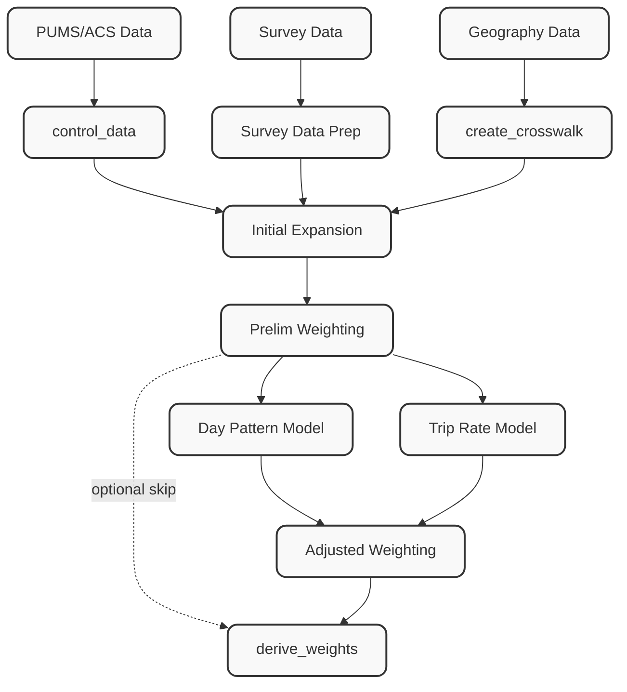

[← Back to Main README](../../../README.md)

# Weighting Pipeline — Development Plan

This document describes the planned architecture for the full weighting pipeline. The existing `add_existing_weights` step handles the case where external weights are already available. This plan covers computing weights from scratch using PUMS/ACS data as population controls.

---

## Overview

The weighting pipeline produces **expansion weights** that scale the survey sample to represent the full population. It is exposed as a **single `weighting` pipeline step** — it plugs into the pipeline like any other step via `@step()` and a YAML config block, but internally it is a self-contained module that can also be run standalone outside the pipeline.

Internally the step orchestrates five sub-components:

1. **Geography Crosswalk** — Translate between PUMS PUMAs and the project's custom weighting geography using Census block groups as the intermediary.
2. **Control Data Preparation** — Load PUMS 1-year microdata, apply the crosswalk, and aggregate into marginal control totals using YAML-configured variable bins and cross-tab targets.
3. **Survey Prep** — Recode canonical survey variables into the same bin/group categories as the controls.
4. **Maximum Entropy Weighting** — Expand households into seed records (with optional DOW expansion), then fit weights using PopulationSim's balancer.
5. **Derive Weights** — Propagate final weights to all canonical tables (persons, days, trips, tours).

Day-of-week weighting is supported natively: households are expanded into household-day records so that each travel day can be weighted by user-configurable day groups (e.g., weekday/weekend). DOW groups are fully defined in the YAML config.

Behavioral adjustment models (day pattern, trip rate) are **not in scope for the current phase**.



---

## Open Questions

| # | Question | Notes |
|---|----------|-------|
| 1 | **PopulationSim dependency** | Import the package directly, or copy the core maximum entropy solver? Importing is simpler to maintain; copying removes the dependency but requires vendoring. |
| 2 | **Control geography level** | Which named geography level (e.g., county, super-district) is the primary weighting stratum? Must be expressible via the BG crosswalk. |

---

## Module Structure

The weighting module is exposed to the pipeline as a **single `@step()` entry point** (`weighting.py`). All sub-components live in a `core/` sub-package and can also be imported directly for standalone use.

```
src/processing/weighting/
├── __init__.py
├── existing_weights.py        # ✅ Implemented — attach pre-computed weights
├── weighting.py               # 🔲 Planned — single @step() entry point; orchestrates core/
├── core/
│   ├── __init__.py
│   ├── crosswalk.py           # 🔲 BG-based geography crosswalk
│   ├── control_data.py        # 🔲 PUMS 1-year control totals with YAML-configured bins
│   ├── survey_prep.py         # 🔲 Recode survey variables to match control bins
│   ├── expansion.py           # 🔲 Base design weight + DOW household-day expansion
│   ├── balancer.py            # 🔲 Max entropy balancing via PopulationSim
│   └── derive_weights.py      # 🔲 Propagate weights to all canonical tables
└── DEVELOPMENT_PLAN.md        # 📄 This document
```

---

## Component Specifications

Each sub-component is documented here as a logical unit. They are not pipeline steps — they are internal functions called by the single `weighting` step.

### `core/crosswalk`

**Purpose:** Build an allocation table from PUMS PUMAs to any custom project geography, using Census block groups (BGs) as the intermediary unit. BGs are small enough that a proportional-area split at the BG level is a reasonable approximation to a population-weighted split.

**Inputs:**
- `bg_shapefile`: Census block group polygons (with PUMA assignment field, or joinable to a PUMA layer)
- `custom_geo_shapefile`: Project-specific polygon geography (county, super-district, TAZ cluster, etc.)

**Outputs:**
- `crosswalk`: DataFrame with columns:
  - `puma_id`
  - `custom_geo_id`
  - `bg_id` (for auditability)
  - `allocation_weight` — fraction of this BG's population allocated to this custom zone (sums to 1.0 per BG)

**Approach:**

```
PUMA ←─── Block Groups ───→ Custom Geography
```

1. Intersect BG polygons with custom geography polygons.
2. For each BG × custom-zone intersection, compute `overlap_area / bg_area` as the allocation fraction. Where BG is fully within one zone this is 1.0; partial overlaps are split proportionally by area.
3. Join BG → PUMA lookup to produce the final three-way table.
4. Validate: allocation weights per BG sum to 1.0; every PUMA has at least one BG.

**Notes:**
- Area-proportional is an approximation; a population-weighted version could use BG population from the decennial census or ACS summary file as a future enhancement.
- The crosswalk is geography-only — no survey or PUMS data dependency — and can be cached and reused across surveys.

---

### `core/control_data`

**Purpose:** Load PUMS 1-year household/person microdata, apply the geography crosswalk to distribute totals into custom zones, and aggregate into marginal control totals using YAML-configured variable definitions.

**Inputs:**
- `pums_households`: PUMS household CSV/Parquet (with `WGTP`, PUMA ID, and control variable columns)
- `pums_persons`: PUMS person CSV/Parquet (with `PWGTP` and demographic columns)
- `crosswalk`: from `core/crosswalk`
- Control variable configuration (YAML — see below)

**Outputs:**
- `controls`: List of control tables, one per control specification, each with columns `[custom_geo_id, category, target_total]`

**Control Variable YAML Configuration:**

Controls are defined in the pipeline YAML. Each control specifies a source table (`households` or `persons`), the PUMS variable(s) to use, how to bin/group values, and whether it is a marginal or a cross-tab.

```yaml
# All parameters are under the single `weighting` step
- name: weighting
  params:
    pums_households: "{{ pums_dir }}/psam_h06.csv"
    pums_persons:    "{{ pums_dir }}/psam_p06.csv"

    controls:

      # Simple marginal — household size, grouped into bins
      - name: hh_size
        table: households
        variable: NP              # PUMS persons-per-household
        bins:
          "1":  [1, 1]
          "2":  [2, 2]
          "3":  [3, 3]
          "4+": [4, 99]

      # Grouped marginal — commute mode collapsed to broad categories
      - name: commute_mode
        table: persons
        variable: JWTRNS          # PUMS means of transportation to work
        groups:
          drove_alone: [1]
          carpool:     [2, 3]
          transit:     [4, 5, 6, 7, 8, 9]
          other:       [10, 11, 12]
        filter: "ESR in [1,2,4,5]"   # employed persons only

      # Cross-tab — age by sex
      - name: age_by_sex
        table: persons
        cross_tab:
          - variable: AGEP
            bins:
              "0-17":  [0, 17]
              "18-34": [18, 34]
              "35-64": [35, 64]
              "65+":   [65, 120]
          - variable: SEX
            groups:
              male:   [1]
              female: [2]
```

**Approach:**
1. Load PUMS data; join persons to households to carry PUMA geography.
2. Join crosswalk; multiply PUMS weight by `allocation_weight` to distribute each PUMA record into custom zones.
3. For each control specification:
   - Apply any `filter` expression to subset the population.
   - Recode the variable(s) into the declared bins/groups.
   - For cross-tabs, form the Cartesian category label (e.g., `"18-34 × female"`).
   - Aggregate weighted sum by `(custom_geo_id, category)` → `target_total`.
4. Validate: marginals sum to total population within each zone.

---

### `core/survey_prep`

**Purpose:** Recode canonical survey variables into the same bin/group categories defined for PUMS controls so the two datasets are directly comparable.

**Inputs:**
- `households`, `persons`: Canonical survey tables
- Same control variable YAML configuration used in `core/control_data`

**Outputs:**
- `households`, `persons`: With added recoded stratum columns (e.g., `hh_size_cat`, `commute_mode_cat`, `age_sex_cat`)

**Approach:**
- Driven entirely by the control YAML: the same bin/group definitions are applied to survey fields that correspond to the PUMS variables.
- A field-mapping config maps PUMS variable names to canonical survey field names (e.g., `NP` → `num_people`, `AGEP` → `age`).
- Records that fall outside any defined bin are flagged; the pipeline can be configured to error, warn, or place them in an "other" catch-all.

```yaml
# Field mapping lives under the single weighting step params
field_mapping:
  households:
    NP: num_people
    HINCP: income
  persons:
    AGEP: age
    SEX: sex
    JWTRNS: commute_mode_code
```

---

### `core/expansion`

**Purpose:** Compute a base design weight for each record (household or household-day) that corrects for geographic sampling imbalances before balancing.

**Inputs:**
- `households` with recoded stratum columns (from `core/survey_prep`)
- `controls` (from `core/control_data`)
- `crosswalk` (from `core/crosswalk`)
- `days` table (required only when `dow_weighting: true`)

**Outputs:**
- `seed_records`: DataFrame ready for the balancer, one row per household (or per household-day if DOW weighting is enabled), with:
  - `base_weight` — raw design weight
  - All recoded stratum columns
  - `custom_geo_id`
  - `dow_group` (if DOW weighting)

**Day-of-Week Expansion:**

When `dow_weighting: true`, each household is replicated once per observed travel day, forming a **household-day** seed table. Each household-day inherits the household's stratum variables and is additionally tagged with its day-of-week group. The balancer then fits a separate weight for each household-day, allowing over/under-represented days to be corrected independently.

```yaml
# DOW config lives under the single weighting step params
dow_weighting: true
dow_groups:
  weekday: [1, 2, 3, 4, 5]   # Mon–Fri (day_of_week integer, 1=Mon)
  weekend: [6, 7]             # Sat–Sun
# Or finer-grained:
# dow_groups:
#   monday_thursday: [1, 2, 3, 4]
#   friday: [5]
#   saturday: [6]
#   sunday: [7]
```

**Base Weight Calculation:**
- `base_weight = (PUMS total HH in custom_geo_zone) / (surveyed HH in custom_geo_zone)`
- For household-day records, the base weight is further scaled by `(target DOW group days / observed DOW group days in sample)`.

---

### `core/balancer`

**Purpose:** Balance the seed record weights to match all control marginals simultaneously using a maximum entropy algorithm.

**Inputs:**
- `seed_records` with `base_weight` and stratum columns (from `core/expansion`)
- `controls` list (from `core/control_data`)
- Balancing parameters

**Outputs:**
- `seed_records` with `final_weight` column added

**Algorithm — Maximum Entropy Balancing:**

The maximum entropy approach (used in [PopulationSim](https://github.com/ActivitySim/populationsim)) finds the weight vector **w** closest to the seed weights **w₀** (in a KL-divergence sense) subject to the linear constraints imposed by the control marginals:

```
minimize  Σᵢ wᵢ · ln(wᵢ / w₀ᵢ)        (KL divergence from seed)
subject to  A · w = t                   (marginal control constraints)
            wᵢ ≥ 0
```

where **A** is the indicator matrix (row = control category × zone, column = seed record) and **t** is the vector of target totals.

**Implementation:**
- Primary path: import and use `populationsim`'s core balancer directly (weight capping/flooring handled by PopulationSim's built-in mechanisms).
- Fallback: vendor the core maximum entropy solver (a compact iterative algorithm) if the full PopulationSim dependency is undesirable.
- Run balancing per geography zone; zones are independent and can be parallelized.

**Configuration (under the single `weighting` step):**

```yaml
max_iterations: 1000
convergence_threshold: 0.001
use_populationsim: true  # false = use vendored solver
```

**Diagnostics output:**
- Convergence status and iteration count per zone
- Final vs. target marginals (absolute and relative difference)
- Weight distribution summary (min, max, mean, CV, effective sample size)

---

### `core/derive_weights`

**Purpose:** Propagate the final household (or household-day) weight down to all canonical survey tables: persons, days, trips, and tours.

**Inputs:**
- `seed_records` with `final_weight` (from `core/balancer`)
- `households`, `persons`, `days`, `linked_trips`, `unlinked_trips`, `tours`

**Outputs:**
- All canonical tables with their respective weight columns populated (always — not optional):

| Table | Weight Column | Derivation |
|-------|--------------|------------|
| `households` | `hh_weight` | Direct from balancer |
| `persons` | `person_weight` | Carry forward `hh_weight` via `hh_id` |
| `days` | `day_weight` | Household-day weight (if DOW weighting) or `person_weight` via `person_id` |
| `unlinked_trips` | `unlinked_trip_weight` | Carry forward `day_weight` via `day_id` |
| `linked_trips` | `linked_trip_weight` | Mean of constituent `unlinked_trip_weight` |
| `tours` | `tour_weight` | Mean of constituent `linked_trip_weight` |

**DOW Weight Integration:**
- When DOW weighting is active, `day_weight` comes directly from the household-day seed record's `final_weight` (which varies by day-of-week group).
- Downstream trip and tour weights inherit this day-specific value, allowing correct expansion of weekday vs. weekend travel behavior.

**Checksums** (logged as warnings if violated):
- `sum(person_weight) ≈ sum(hh_weight × persons_per_hh)`
- `sum(day_weight) ≈ sum(person_weight × complete_travel_days_per_person)`
- `sum(unlinked_trip_weight) ≈ sum(day_weight × trips_per_day)`

---

## Integration with Pipeline

The entire weighting process is a **single pipeline step**. All sub-component parameters are nested under one `weighting` config block:

```yaml
# After custom_add_zone_ids, before final_check

- name: weighting
  params:
    # Geography crosswalk inputs
    bg_shapefile: "{{ geo_dir }}/tl_2022_06_bg.shp"          # Census block groups
    custom_geo_shapefile: "{{ geo_dir }}/weighting_zones.shp"
    custom_geo_id_field: "zone_id"

    # PUMS 1-year data
    pums_households: "{{ pums_dir }}/psam_h06.csv"
    pums_persons:    "{{ pums_dir }}/psam_p06.csv"

    # Field mapping: PUMS variable → canonical survey field
    field_mapping:
      households:
        NP: num_people
      persons:
        AGEP: age
        SEX: sex
        JWTRNS: commute_mode_code

    # Control variable definitions
    controls:
      - name: hh_size
        table: households
        variable: NP
        bins:
          "1":  [1, 1]
          "2":  [2, 2]
          "3":  [3, 3]
          "4+": [4, 99]
      - name: age_by_sex
        table: persons
        cross_tab:
          - variable: AGEP
            bins:
              "0-17":  [0, 17]
              "18-64": [18, 64]
              "65+":   [65, 120]
          - variable: SEX
            groups:
              male:   [1]
              female: [2]

    # Day-of-week weighting
    dow_weighting: true
    dow_groups:
      weekday: [1, 2, 3, 4, 5]
      weekend: [6, 7]

    # Balancer settings
    max_iterations: 1000
    convergence_threshold: 0.001
    use_populationsim: true
```

---

## Implementation Order

1. `core/crosswalk` — geography only, no survey/PUMS dependency; can be built and tested standalone
2. `core/control_data` — depends on PUMS data and crosswalk; drives the YAML control spec design
3. `core/survey_prep` — depends on canonical data models and control YAML spec
4. `core/expansion` — integrates survey + controls + crosswalk; includes DOW expansion logic
5. `core/derive_weights` — can be prototyped early since it extends existing `existing_weights.py` hierarchy logic
6. `core/balancer` — depends on `core/expansion` + `core/control_data`; requires PopulationSim integration decision
7. `weighting.py` — single `@step()` entry point that wires all of the above together
