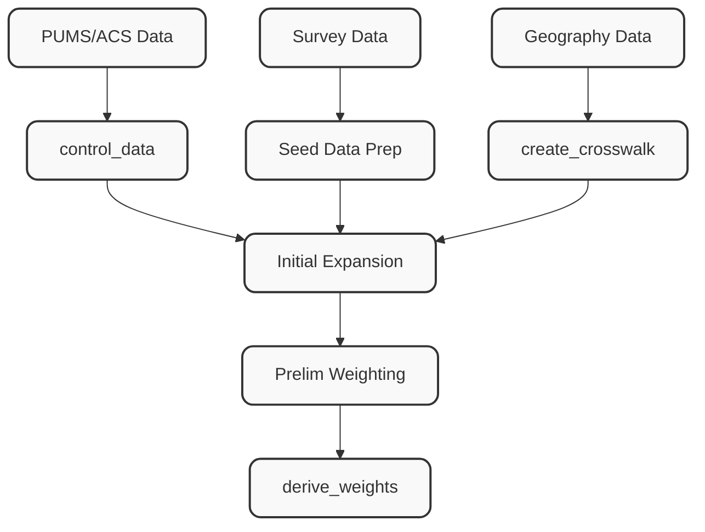

[← Back to Main README](../../../README.md)

# Weighting Module

This module provides two pipeline steps for attaching weights to survey tables:

1. **`add_existing_weights`** — Load pre-computed weights from CSV files and join them to tables.
2. **`weighting`** — Compute weights from scratch using PUMS/ACS data as population controls.

See [DEVELOPMENT_PLAN.md](DEVELOPMENT_PLAN.md) for remaining planned features.

---

## Pipeline Steps

### `add_existing_weights`

Loads weight files and joins them to survey data tables. Can optionally derive missing weights by propagating values from upstream tables in the survey hierarchy.

**Inputs:**
- Survey tables (pl.DataFrame, all optional):
  - `households`: Household records
  - `persons`: Person records
  - `days`: Day records (if available)
  - `unlinked_trips`: Individual trip segments
  - `linked_trips`: Aggregated journey records
  - `joint_trips`: Joint household travel records
  - `tours`: Tour records
- `weights`: Dictionary mapping config keys to weight file specifications (dict[str, dict[str, str]])
  - Config keys: `household_weights`, `person_weights`, `day_weights`, `unlinked_trip_weights`, `linked_trip_weights`, `joint_trip_weights`, `tour_weights`
  - Each config must contain:
    - `weight_path`: Path to CSV file containing weights (required)
    - `id_col`: ID column name in main table (optional, uses default from mapping)
    - `weight_id_col`: ID column name in weight file (optional, defaults to `id_col`)
    - `weight_col`: Weight column name (optional, uses default from mapping)
- `derive_missing_weights`: Whether to derive weights for tables without provided weight files (bool, default: False)

**Outputs:**
- Dictionary containing all input tables with weight columns attached:
  - Weight column names: `hh_weight`, `person_weight`, `day_weight`, `unlinked_trip_weight`, `linked_trip_weight`, `joint_trip_weight`, `tour_weight`

**Weight Hierarchy:**

```
hh_weight
  └─ person_weight (carry forward via hh_id)
      └─ day_weight (carry forward via person_id)
          └─ unlinked_trip_weight (carry forward via day_id)
              ├─ linked_trip_weight (mean aggregation via linked_trip_id)
              ├─ joint_trip_weight (mean aggregation via joint_trip_id)
              └─ tour_weight (mean aggregation via tour_id)
```

**Core Algorithm:**

**Phase 1: Load and Join Weights**
1. For each provided weight config:
   - Validate config key matches allowed table types
   - Load weight CSV file from `weight_path`
   - Validate required ID and weight columns exist
   - Handle ID column name mismatches between tables and weight files:
     - Rename weight file ID column to match table if needed
   - Left join weights to table on ID column
   - Track which tables now have weights

**Phase 2: Derive Missing Weights** (if `derive_missing_weights=True`)
1. **Hierarchical carry-forward** for household → person → day → unlinked_trip:
   - For each child table without provided weights:
     - Validate parent table has weights (error if missing - indicates gap)
     - Select parent's ID and weight columns
     - Rename parent weight to child weight name
     - Left join to child table on hierarchical key

2. **Aggregated weights** for linked_trip, joint_trip, tour:
   - For each target table without provided weights:
     - Skip if source table lacks weights or doesn't exist
     - Calculate mean weight per group (linked_trip_id, joint_trip_id, tour_id)
     - Exclude null and zero weights from mean calculation
     - Left join aggregated weights to target table

**Configuration Example:**

```yaml
- name: add_existing_weights
  params:
    derive_missing_weights: true
    weights:
      household_weights:
        weight_path: "weights/hh_weights.csv"
        # Uses defaults: id_col='hh_id', weight_col='hh_weight'

      person_weights:
        weight_path: "weights/person_weights.csv"

      unlinked_trip_weights:
        weight_path: "weights/trip_weights.csv"
        id_col: "trip_id"              # Custom ID in main table
        weight_id_col: "unlinked_trip_id"  # Custom ID in weight file
        weight_col: "trip_weight"       # Custom weight column name
```

**Notes:**
- **ID Column Flexibility:** Supports different ID column names between tables and weight files
- **Weight Column Customization:** Override default weight column names via config
- **Hierarchical Derivation:** Ensures consistent weights across related tables when only top-level weights provided
- **Gap Detection:** Raises errors if middle-tier weights missing (e.g., have household + trip but not person/day)
- **Aggregation Strategy:** Uses mean for deriving weights from multiple source records, excluding zeros and nulls
- **Weight Validation:** All required columns validated before joining to catch config errors early

---

## Geography Crosswalk

The weighting step uses a population-weighted geography crosswalk to map
source zones (e.g. Census PUMAs) to target zones (counties, TAZs, etc.).

- **Generic crosswalk builder:** [`src/utils/crosswalk.py`](../../../src/utils/crosswalk.py) — see [`src/utils/CROSSWALK.md`](../../../src/utils/CROSSWALK.md) for math, diagrams, and API docs.
- **PUMA-specific wrapper:** [`PumaCrosswalk`](core/crosswalk.py) — fetches Census geographies and delegates to `build_crosswalk`, then renames outputs for PUMS consumers.

---

## `weighting` Step

The `weighting` step computes expansion weights from scratch using PUMS/ACS microdata as population controls. It is exposed as a **single `@step()` entry point** (`weighting.py`) that internally orchestrates five sub-components, but can also be imported and run standalone.

### Overview

The pipeline produces **expansion weights** that scale the survey sample to represent the full population.

Internally the step orchestrates:

1. **Geography Crosswalk** — Translate between PUMS PUMAs and the project's custom weighting geography using Census block groups as the intermediary.
2. **Control Data Preparation** — Load PUMS 1-year microdata, apply the crosswalk, and aggregate into marginal control totals using YAML-configured variable bins.
3. **Survey Prep** — Recode canonical survey variables into the same bin/group categories as the controls.
4. **Maximum Entropy Weighting** — Expand households into seed records, then fit weights using PopulationSim's balancer.
5. **Derive Weights** — Propagate final weights to all canonical tables (persons, days, trips, tours).

Day-of-week weighting is planned (see [DEVELOPMENT_PLAN.md](DEVELOPMENT_PLAN.md)).



### Design Decisions

| # | Decision | Resolution |
|---|----------|------------|
| 1 | **PopulationSim dependency** | Use PopulationSim's core numba balancer (`np_balancer_numba`) directly, bypassing PopulationSim's pipeline/config infrastructure. If the numba function proves awkward, step up to `ListBalancer`. If even that is too entangled, port the core algorithm (~120 lines of self-contained Newton-Raphson). |
| 2 | **Control geography level** | Always user-specified via YAML config. If the user's geography aligns with PUMAs, the crosswalk is a pass-through. Otherwise, the BG-based crosswalk converts PUMA controls into the custom geography. There is no default geography level. |

### Module Structure

```
src/processing/weighting/
├── __init__.py
├── existing_weights.py        # attach pre-computed weights
├── weighting.py               # single @step() entry point
├── DEVELOPMENT_PLAN.md
│
├── controls/                  # control variable definitions
│   ├── __init__.py
│   ├── enums.py               #   IntEnum categories for collapsing controls
│   ├── base.py                #   ControlLevel, ControlTarget base class, shared helpers
│   ├── household.py           #   HHSize, HHIncome, HHWorkers, HHVehicles, HHChildren
│   ├── person.py              #   Gender, Employment, CommuteMode, Student, Education, Race, Ethnicity, Age
│   └── registry.py            #   CONTROLS dict, resolve_targets(), pums_variables()
│
├── data_prep/                 # PUMS I/O, recoding, geography + crosswalk
│   ├── __init__.py
│   ├── census_geo.py          #   TIGER shapefile download via pygris (PUMAs, blocks)
│   ├── crosswalk.py           #   rasterized PUMA→target-zone crosswalk (exactextract)
│   ├── pums_data.py           #   PUMS download/load via Census API (requests)
│   ├── control_data.py        #   PUMS control totals (crosswalk-aware)
│   └── seed_data.py           #   recode survey variables to match controls
│
├── balancing/                 # the weighting engine
│   ├── __init__.py
│   ├── balancer.py            #   max entropy balancing (PopulationSim numba core)
│   ├── base_weights.py        #   initial expansion weights (sample-plan or PUMS-target)
│   ├── weight_propagation.py  #   propagate weights to all canonical tables
│   └── importance.py          #   MOE-based importance from PUMS replicate weights
│
├── diagnostics/               # HTML report + crosswalk map
│   ├── __init__.py
│   ├── charts.py              #   Plotly chart builders (fit bars, violins, crosswalk map)
│   ├── data.py                #   data transforms (fit table, merge collapse, weighted totals)
│   ├── report.py              #   Jinja2 report orchestrator
│   ├── tables.py              #   HTML table builders (zone overview, weight dist, sparsity)
│   └── diagnostics_template.html
│
└── validation/                # post-balancing checks
    ├── __init__.py
    ├── checksums.py           #   recode null checks + incidence-sum overcount detection
    └── weight_checks.py       #   post-balancing sanity checks
```

---

### Component Details

#### Crosswalk (`data_prep/crosswalk.py`)

Build a population-weighted allocation table from PUMS PUMAs to any custom project geography using Census blocks as the scaling layer. Uses `rasterio` to create a population-density grid from block polygons and `exactextract` for exact fractional zonal statistics.

**Inputs:**
- Target zone polygon file (shapefile / GeoJSON)
- State FIPS code and PUMS year (to determine PUMA vintage)
- Resolution in meters (default 250m)

**Outputs:**
- `crosswalk`: pl.DataFrame — `puma_id`, `ctrl_geoid`, `population`, `allocation_weight`
- `puma_ids`: list[str] — PUMAs overlapping the study area

**Approach:**

```
Target Zones ──────────────────────────────→ exactextract (fractional zonal stats)
                                                 ↑
Census Blocks → rasterize pop → pop grid ────────┘
                                                 ↑
PUMAs         → rasterize IDs → label grid ──────┘
```

1. Load target zone polygons; auto-discover overlapping PUMAs.
2. Download/cache TIGER PUMA and block shapefiles (via `census_geo.py`).
3. Rasterize block population into a density grid.
4. Rasterize PUMA IDs into a categorical label grid.
5. `exactextract`: compute `sum(population)` per target zone, grouped by PUMA label.
6. Normalize: `allocation_weight = pop(puma, target) / pop(puma)` per PUMA.

Resolution only affects within-block population distribution granularity — boundary accuracy is exact at any resolution due to `exactextract`'s analytical sub-cell coverage.

---

#### Census Geography (`data_prep/census_geo.py`)

Download and cache Census TIGER/Line shapefiles for PUMAs and blocks. TABBLOCK20 files include `POP20` directly from the 2020 decennial census — no separate population table join needed.

---

#### PUMS Data (`data_prep/pums_data.py`)

Fetch PUMS 1-year microdata from the Census API (direct HTTP via `requests`) or load from local files.

- All PUMAs batched in a single API request
- Column chunking when >48 columns (API limit ~50), parallel via `ThreadPoolExecutor`
- JSON → Polars directly (no pandas)
- Streaming download with `tqdm` progress bars
- Parquet caching at `cache_dir/pums/{state}_{year}_{hh|person}.parquet`

---

#### Control Data (`data_prep/control_data.py`)

Load PUMS microdata, apply the geography crosswalk to distribute totals into custom zones, and aggregate into marginal control totals.

**Control Variable YAML Configuration:**

```yaml
controls:
  # Simple marginal — household size
  - name: h_size
    table: households
    variable: NP
    bins:
      "1":  [1, 1]
      "2":  [2, 2]
      "3":  [3, 3]
      "4+": [4, 99]

  # Grouped marginal — commute mode
  - name: commute_mode
    table: persons
    variable: JWTRNS
    groups:
      drove_alone: [1]
      carpool:     [2, 3]
      transit:     [4, 5, 6, 7, 8, 9]
      other:       [10, 11, 12]
    filter: "ESR in [1,2,4,5]"   # employed persons only
```

**Approach:**
1. Load PUMS data; join persons to households to carry PUMA geography.
2. Join crosswalk; multiply PUMS weight by `allocation_weight` to distribute into custom zones.
3. For each control: apply filter, recode variable into bins/groups, aggregate weighted sum by `(ctrl_geoid, category)`.

---

#### Seed Data (`data_prep/seed_data.py`)

Recode canonical survey variables into the same bin/group categories defined for PUMS controls.

- Driven entirely by the control YAML — same bin/group definitions applied to survey fields.
- A `field_mapping` config maps PUMS variable names to canonical survey field names (e.g., `NP` → `num_people`, `AGEP` → `age`).

```yaml
field_mapping:
  households:
    NP: num_people
    HINCP: income
  persons:
    AGEP: age
    SEX: sex
    JWTRNS: commute_mode_code
```

---

#### Base Weights (`balancing/base_weights.py`)

Compute initial design weights that correct for geographic sampling imbalances before balancing.

`base_weight = (PUMS total HH in zone) / (surveyed HH in zone)`

---

#### Balancer (`balancing/balancer.py`)

Balance seed record weights to match all control marginals simultaneously using maximum entropy.

**Algorithm:** Find weight vector **w** closest to seed weights **w₀** (KL-divergence) subject to marginal constraints:

$$\min \sum_i w_i \ln(w_i / w_{0i}) \quad \text{s.t.} \quad Aw = t, \; w_i \ge 0$$

where **A** is the incidence matrix and **t** is the target totals vector.

**Implementation:** Calls `populationsim.balancing.balancers_numba.np_balancer_numba` directly — a pure `@njit` function (~120 lines) taking numpy arrays. No PopulationSim pipeline infrastructure involved. Runs per control geography zone (zones are independent, parallelizable).

**Configuration:**

```yaml
max_iterations: 1000
convergence_threshold: 0.001
max_expansion_factor: 10        # upper bound = initial_weight × factor
min_expansion_factor: 0.1       # lower bound = initial_weight × factor
```

---

#### Importance (`balancing/importance.py`)

Three-tier importance system for the balancer:

1. **Default** — `100` for all controls
2. **MOE-based** — uses PUMS replicate weights (`WGTP1`–`WGTP80` / `PWGTP1`–`PWGTP80`) via `samplics` to estimate per-control CV, then normalizes so median importance = 100. Transfer function: `1/sqrt(CV)`.
3. **Explicit override** — per-control `importance:` in YAML takes highest precedence.

Structural controls (`h_total`, `p_total`) always receive fixed `1000` importance regardless of MOE.

---

#### Weight Propagation (`balancing/weight_propagation.py`)

Propagate household weights to all canonical tables:

| Table | Weight Column | Derivation |
|-------|--------------|------------|
| `households` | `hh_weight` | Direct from balancer |
| `persons` | `person_weight` | Carry forward `hh_weight` via `hh_id` |
| `days` | `day_weight` | Carry forward `person_weight` via `person_id` |
| `unlinked_trips` | `unlinked_trip_weight` | Carry forward `day_weight` via `day_id` |
| `linked_trips` | `linked_trip_weight` | Mean of constituent `unlinked_trip_weight` |
| `tours` | `tour_weight` | Mean of constituent `linked_trip_weight` |

**Checksums** (logged as warnings if violated):
- `sum(person_weight) ≈ sum(hh_weight × persons_per_hh)`
- `sum(day_weight) ≈ sum(person_weight × complete_travel_days_per_person)`
- `sum(unlinked_trip_weight) ≈ sum(day_weight × trips_per_day)`

---

#### Validation (`validation/`)

- **`checksums.py`** — Recode null checks and incidence-sum overcount detection.
- **`weight_checks.py`** — Post-balancing sanity checks.

---

#### Diagnostics (`diagnostics/`)

Self-contained interactive HTML diagnostic report. Uses Plotly for all charts; output is a single `.html` file with no external dependencies.

**Report sections:**

1. **Recode Coverage** — Null leak summary per control (PUMS vs survey null rates).
2. **Weight Summary** — Initial, final, and target weight sums for households and persons.
3. **Target Fit** — % error bar charts per zone and overall. Color-coded: green < 2%, yellow 2–5%, red > 5%.
4. **Expansion Factor Calibration** — MAPE vs CV dual-axis plot across a grid of `max_expansion_factor` values.
5. **Weight Distribution** — Violin/jitter plots per zone showing `final_weight / base_weight` ratios.
6. **Seed vs Targets** — Detailed table of every control cell in every zone (seed count, target, weighted sum, % error).
7. **Convergence & ESS** — Per-zone convergence metadata, effective sample size (`(Σwᵢ)² / Σwᵢ²`), design effect.

**Configuration:**

```yaml
diagnostics:
  enabled: true
  output_path: "weighting_diagnostics.html"
  fit_error_thresholds: [2, 5]
  min_seed_count_warning: 10
  expansion_factor_grid: [2, 4, 6, 8, 10, 15, 20, 30, 50]
  plotly_cdn: true
```

---

### Full Configuration Example

```yaml
- name: weighting
  params:
    # Geography crosswalk inputs
    bg_shapefile: "{{ geo_dir }}/tl_2022_06_bg.shp"
    custom_geo_shapefile: "{{ geo_dir }}/weighting_zones.shp"
    custom_geo_id_field: "zone_id"

    # PUMS 1-year data
    pums_households: "{{ pums_dir }}/psam_h06.csv"
    pums_persons:    "{{ pums_dir }}/psam_p06.csv"

    # Field mapping: PUMS variable → canonical survey field
    field_mapping:
      households:
        NP: num_people
      persons:
        AGEP: age
        SEX: sex
        JWTRNS: commute_mode_code

    # Control variable definitions
    controls:
      - name: h_size
        table: households
        variable: NP
        bins:
          "1":  [1, 1]
          "2":  [2, 2]
          "3":  [3, 3]
          "4+": [4, 99]

    # Balancer settings
    max_iterations: 1000
    convergence_threshold: 0.001
    max_expansion_factor: 10
    min_expansion_factor: 0.1

    # Diagnostics
    diagnostics:
      enabled: true
      fit_error_thresholds: [2, 5]
      min_seed_count_warning: 10
```
